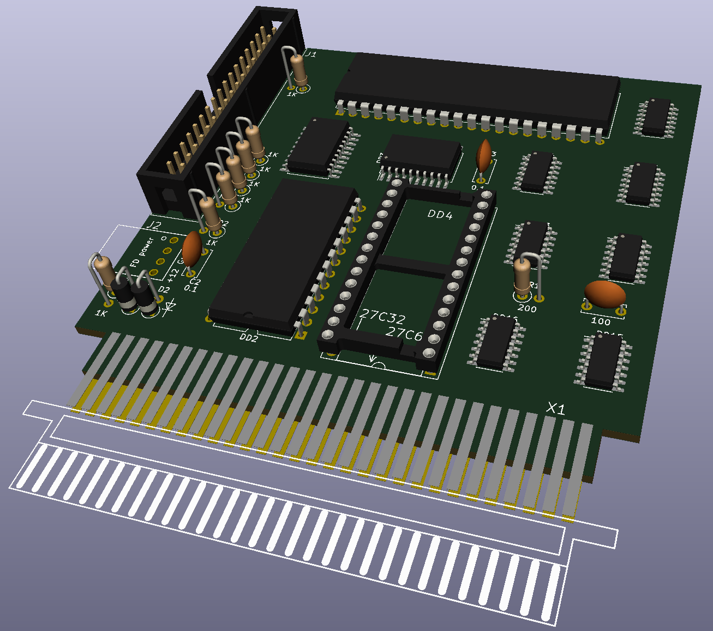
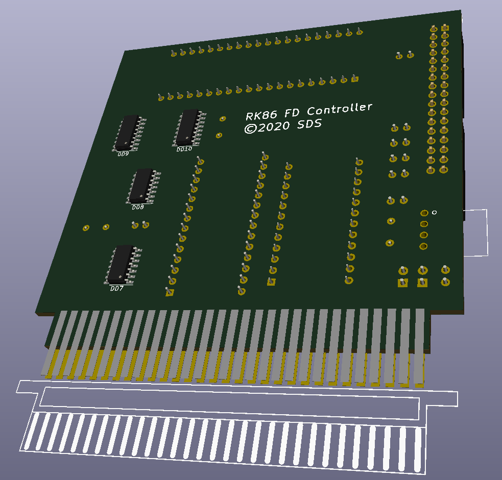

# rk86kngmd

A replica of 1993 floppy disc controller for "Radio-86RK" computers. Built around i8255 PPI chip (Soviet clone: КР580ВВ55А) a handful of discrete logic chips.

This version is a compact rework of the replica. 

- Compact layout
- SOIC 74LS series chips are used instead of DIP 555 logic
- Kept К555ИР13 and КР580ВВ55А (they are much easier to source than i8255 and 74LS198)
- 28-pin ROM socket accepts 2732 OR 2764 chips
- Added 34-pin standard floppy cable connector and 4-pin Berg power supply connector
- Added diode AND circutry to form ROM CS signal from CS1/CS2
- Added two bypass capacitors for stability

